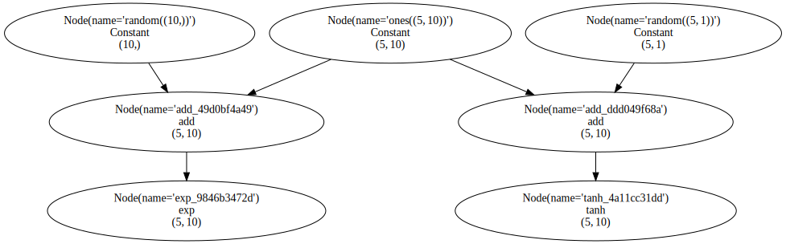
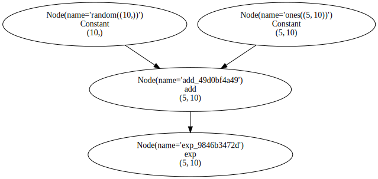

# `composit`
ML framework for composing neural networks and mapping them to heterogeneous backends with as minimum levels of abstraction as possible


# Installation Instructions
```bash
./install.sh
```

# Why `composit`?
There are plenty of ML frameworks out there, so what's the point of this one?
The best way to answer this question is to let the reader try to add a new hardware-specific feature to an existing framework.
That could be something as small as adding a new operation and as big as implementing a backend for a whole new accelerator.
That's usually when most of the frameworks out there stop being user-friendly and start becoming very cumbersome to deal with.

The aim of `composit` is to make it easier to add new hardware-specific features. And, in general, to encourage hand-made approach
for writing neural networks. That means giving the user an ability to map a given neural network architecture to the desired hardware
and allowing the user to manually optimize during any step of the process.

`composit` is written in a way that allows it to be easily extended. Adding a new operation or a new backend means adding on top of `composit`, not to it.

`composit` is written using pure functions which helps it achieve the stated goals.

# Using `composit`
## `composit.numpy`
The main building block of `composit` is its `numpy` submodule.

This submodule allows writing computational graphs using `numpy` APIs.
It's important to note that it's not `numpy`-like, but instead it's exactly like `numpy` (with, so far, only the notable exception of `__setitem__` method of `np.ndarray`)

#### Simplest example
Here is one of the simplest examples of specifying computations using `composit`'s `numpy`:
```python
import composit.numpy as cnp
from composit.types import LazyTensor

input: LazyTensor = cnp.ones((2, 3), dtype="float32")
output: LazyTensor = cnp.exp(input)
```
The code above looks exactly the same as the one that would be written using `numpy` itself if `cnp` was replaced with `np`.
The difference is that no computations have been actually performed.
What happened instead was:
1. `np.ones` created a constant array of ones and stored it in a node
2. `np.exp` created an exponent instruction that will be used to evaluate the `output`, stored it in another node and added an edge from the node of `input` to the new node

And that is possible because every `LazyTensor` stores the computational graph, needed to evaluate it, as `graph` attribute.
But obviously having the `graph` is not always enough to know what node is the output one, so it also has a `node` attribute to specify which node corresponds to the given `LazyTensor`.
And finally, some instructions like `np.split` can have multiple outputs themselves, so `LazyTensor` has an `output_index` attribute
to handle that case.

As part of `numpy` interface, `LazyTensor` has `shape`, `dtype` and `rank` property methods.

Finally, it also has a `name` property method.

An obvious question, is "Where are these properties stored?". And the answer is that they are stored inside of the `graph`.
This will be explained in more detail later, but for now, all that is needed be to known is that 
the `graph` is a persistent version of `networkx.MultiDiGraph`. And `networkx.MultiDiGraph` allows storing the attributes on both nodes and edges.


Finally, let's evaluate the graph:
```python
np_output: np.ndarray = cnp.evaluate(output)
```

All that was needed was just a call to `cnp.evaluate`. 
Internally, it traversed the graph, skipped over the input and ran the exponent instruction using `numpy` as the backend.

A key thing to get out of this example is that `cnp.evaluate` operates on top of the tensors.
So, theoretically (and practically, as will be shown later), it can be re-written using any other backend.

#### Multi-input and multi-output example
Let's dive into another example. This time with multiple inputs and outputs.
```python
import composit as cnp
from composit.types import LazyTensor

input_a: LazyTensor = cnp.ones((5, 10), dtype="float32")
input_b: LazyTensor = cnp.random.random((10,))
input_c: LazyTensor = cnp.random.random((5, 1))
exp: LazyTensor = cnp.exp(input_a + input_b)
tanh: LazyTensor = cnp.tanh(input_a + input_c)
```

`composit` is built with visualization in mind and so the computational graph 
can be easily visualized. All that needs to be done is to pass in the output `LazyTensor`s into `visualize` function:
```python
from composit.types import visualize
visualize(exp, tanh, render=True)
```


As mentioned earlier, a tensor in the computational graph is only aware of the operations leading towards it and the visualization obivously reflects that:
```python
from composit.types import visualize
visualize(exp, render=True)
```


And so does, evaluation:
```python
# Evaluate `input_c` by simply returning the data stored in `input_c`'s node
assert len(input_c.graph) == 1
np_input_c: np.ndarray = cnp.evaluate(input_c)

# Evaluate `exp` (`exp`'s graph only has nodes need to evaluate it)
assert len(exp.graph) == 4
np_exp: np.ndarray = cnp.evaluate(exp)

# Evaluate `exp` and `tanh` (re-use common subgraph)
np_exp, np_tanh = cnp.evaluate(exp, tanh)
```

There is a lot more to explain about the internals of `composit.numpy` but it's more exciting to show what can be built on top of its APIs.

## `composit.nn` (neural networks submodule)
`numpy` by itself is not enough to build a machine learning framework.
Because a machine learning framework needs to have convolution, pool, relu, gelu and a lot of other operations.
Also, it needs to provide the user with an ability to train the network 
which means having functionality to compute the loss, run backward pass, update parameters using an optimizer, etc. 

`nn` module does exactly that.

### Adding a new operation
A new operation can be defined by simply using `wrap_as_operation` decorator around a function that runs numpy operations.

As an example, let's implement `relu`:
```python
import numpy as np

import composit.numpy as cnp
from composit.nn.core import wrap_as_operation

@wrap_as_operation()
def relu(input_tensor: np.ndarray) -> np.ndarray:
    return np.maximum(input_tensor, 0)

input = cnp.random.random((2, 3))
output = relu(input)
assert len(output.graph) == 2
```

That's all it takes to add a new operation.

### Training Infrastructure

`nn` module implements support for training neural networks using backpropagation with 2 functions: `chain_rule` and `optimize`

Here is an example of using them:
```python
import composit as cnp
from composit.nn import chain_rule, optimize
from composit.nn.optimize import sgd_optimizer

def model(input, weight):
    return input @ weight

def loss_function(logits):
    return cnp.mean(logits)
    
weight = cnp.random.random((32, 8))

num_iterations = ...
for iteration in range(num_iterations):
    # Forward
    input = cnp.random.random((16, 32))
    output = model(input, weight)
    loss = loss_function(output)

    # Forward + Backward (only compute the gradient for the weight)
    inputs_that_require_gradients = [weight]
    gradients = chain_rule(
        {loss: loss},
        inputs_that_require_gradients,
    )

    # Forward + Backward + Optimizer
    (weight,) = optimize(
        inputs_that_require_gradients,
        gradients,
        sgd_optimizer(learning_rate=1e-3)
    )
```


`chain_rule` has 2 arguments:
- Dictionary of forward outputs as keys and their gradients as values. Losses map to themselves.
- List of all inputs that require a gradient.
- 
`chain_rule` returns a list of gradients.
If a mapping from input to a gradient is required, it could be achieved by iterating over `zip(inputs_that_require_gradients, gradients)`.


`optimize` has 4 arguments:
- List of all inputs that require a gradient.
- List of their respective gradients.
- Optimizer function that will be used to update the input with the gradient 
- An optional argument to override the evaluate function

`optimize` returns a list of updated inputs.

`optimize` is the only place where evaluation happens and the reason why it allows to override evaluate function is
to let the user run the evaluation using a different backend.


### Layers
Finally, `nn` module also has a library of layers such as `softmax`, `multi_head_attention`, `resnet_module` that implement
those functions using `composit.numpy` and `composit.nn` operations.

All of the layers could be wrapped as an operation but that is not done on purpose within `composit` itself to reduce the number of 
primitives. However, the user can decide whether a particular function should be an operation or not and implement their own version.

## `flashlight`
`composit` provides a numpy-like but what if the user wants to use `torch` to define the model? This is where `flashlight` shines (pun intended)

`flashlight` traces `torch` operations by using a context manager that overrides `torch` APIs.
```python
import torch

import composit as cnp
import flashlight

model = torch.nn.Linear(128, 64)

activations = torch.rand(32, 128)

with flashlight.tracer.trace():
    output = model(activations)

np_output = cnp.evaluate(output)
```

`flashlight` only supports a subset of `torch`. However, it does support enough `torch` APIs to trace Transformers, ResNet and Stable Diffusion networks.

## `mosaic`
`mosaic` is a module to write backends for `composit`.
`mosaic` is still in an early stage of development and idea exploration.

Currently, it has support only for `x86` backend and is only tested using BERT.

`mosaic` does the following currently when running BERT:
1. Tilizes every tensor in the graph using user-provided schema
2. Generates and compiles a C kernel for every operation in the graph
3. Allocates buffers and optionally re-uses them
4. Evaluates the model by running one kernel at a time. (There is also initial implementation for running the whole model from C at once but it doesn't work for large graphs)

There is a lot of future work planned that will be focused on adding more functionality such as kernel fusion, adding other backends, mapping a model to multiplt heterogeneous devices, etc.


